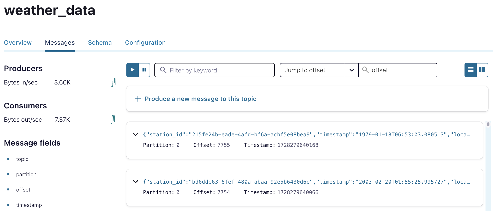
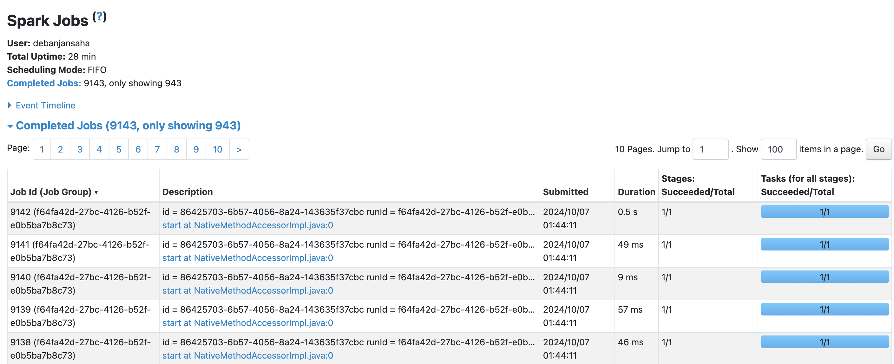
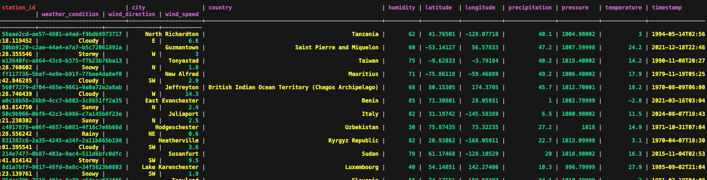

# Weather Data Streaming Pipeline

This project implements a real-time data pipeline to simulate weather data, stream it to Kafka, and process it with Apache Spark before storing it in Cassandra. The pipeline is orchestrated using Apache Airflow for automation and scheduling.

## Table of Contents

- [Weather Data Streaming Pipeline](#weather-data-streaming-pipeline)
  - [Table of Contents](#table-of-contents)
  - [Overview](#overview)
  - [Technologies Used](#technologies-used)
  - [Project Architecture](#project-architecture)
  - [Setup and Installation](#setup-and-installation)
    - [Prerequisites](#prerequisites)
    - [Clone the Repository](#clone-the-repository)
    - [Step-by-Step Installation](#step-by-step-installation)
  - [Airflow DAG](#airflow-dag)
  - [Kafka Producer](#kafka-producer)
    - [Kafka Producer Configuration](#kafka-producer-configuration)
  - [Spark Streaming](#spark-streaming)
    - [Key Spark Functions:](#key-spark-functions)
  - [Cassandra](#cassandra)
  - [Usage](#usage)
    - [Trigger the Pipeline](#trigger-the-pipeline)
    - [Accessing Data in Cassandra](#accessing-data-in-cassandra)
  - [License](#license)

## Overview

The goal of this project is to build a scalable real-time streaming pipeline that generates fake weather data, streams the data into Kafka, processes it using Spark Streaming, and stores the data in a Cassandra database. The pipeline is orchestrated by Airflow.

Key Features:
- **Real-time weather data generation** using the Faker library.
- **Data streaming to Kafka** in a nested JSON format.
- **Data transformation with Spark** to flatten the nested JSON structure.
- **Storage in Cassandra** after transformation.
- **Airflow orchestration** for scheduling and automation.

## Technologies Used

- **Apache Kafka**: Real-time streaming platform to handle weather data streams.
- **Apache Spark**: For data transformation and streaming.
- **Cassandra**: Distributed NoSQL database for storing weather data.
- **Apache Airflow**: Workflow automation and orchestration.
- **Docker**: Containerized services for Kafka, Spark, Airflow, and Cassandra.
- **Faker**: Python library to generate fake weather data.

## Project Architecture


- **Weather Data Generation**: Weather data is generated in a nested JSON format using the Faker library.
- **Kafka**: The generated weather data is pushed to a Kafka topic called `weather_data`.
- **Spark Streaming**: Reads data from Kafka, flattens the JSON, and prepares the data for Cassandra.
- **Cassandra**: Stores the transformed weather data for analytics or further processing.
- **Airflow**: Orchestrates the data pipeline, triggering the data generation and streaming processes.

## Setup and Installation

### Prerequisites

- **Docker** and **Docker Compose** installed.
- **Python 3.8+** installed (for running Airflow and Kafka producer locally if needed).

### Clone the Repository

```bash
git clone https://github.com/debanjansaha-git/kafka-spark-cassandra
cd kafka-spark-cassandra
```

### Step-by-Step Installation

1. **Set up Docker and Docker Compose**:

   The project uses Docker Compose to set up Kafka, Zookeeper, Spark, Cassandra, and Airflow. You can find the configuration in the `docker-compose.yml` file.

   Run the following command to spin up the services:

   ```bash
   docker compose up -d
   ```

   This will start the following services:
   - Kafka Broker and Zookeeper
   - Spark Master and Worker
   - Cassandra Database
   - Airflow Scheduler, Web Server, and Workers

2. **Airflow Setup**:

   Access the Airflow web interface by navigating to [http://localhost:8080](http://localhost:8080) in your browser. The default username and password for Airflow is `admin/admin`.

3. **Configure Airflow DAG**:

   The DAG file is located in the `dags/` folder. When the DAG bag is loaded, you can trigger the `weather_data_streaming` DAG to start the streaming pipeline.

   The DAG schedules the weather data generation and Kafka streaming.

4. **Access Kafka using Confluent Control Center**

   Access the Kafka Cluster by navigating to [http://localhost:9021](http://localhost:9021) in your browser. Here you can view the overall status, throughput of the cluster, along with the details about the broker and the topics.
   
   From there you can navigate to the Topics to view the messages which are published to the topic as below:

    

5. **Access Spark Cluster**

   Access the Spark Driver by navigating to [http://localhost:9090](http://localhost:9090) in your browser. While the Spark UI can be accessed at [http://localhost:4041](http://localhost:4041) or [http://localhost:4042](http://localhost:4042) in your browser.

    

6. **Access Cassandra**:

   Cassandra is accessible at `localhost:9042`. You can connect to the Cassandra CLI using:

   ```bash
   docker exec -it cassandra cqlsh -u cassandra -p cassandra localhost 9042
   ```

   The Spark job will automatically create the `weather_data` table in the `spark_streams` keyspace.

    

## Airflow DAG

The DAG is responsible for orchestrating the pipeline, ensuring tasks are run in the correct order and at the correct intervals.

- **DAG File Location**: `dags/weather_data_streaming.py`
- **Task**: The DAG contains a PythonOperator that runs the `stream_weather_data` function.

To trigger the DAG manually:

1. Go to [http://localhost:8080](http://localhost:8080).
2. Trigger the `weather_data_streaming` DAG from the Airflow UI.


## Kafka Producer

The weather data is generated using the `Faker` library and pushed to Kafka in nested JSON format. The producer pushes data to the `weather_data` topic, which is later consumed by Spark.

### Kafka Producer Configuration

The Kafka producer setup is configured in the `kafka_stream.py` script:

```python
producer = KafkaProducer(
    bootstrap_servers=["broker:29092"],
    value_serializer=lambda v: json.dumps(v).encode("utf-8"),
    max_block_ms=5000,
)
```

To manually stream data to Kafka:

```bash
python kafka_stream.py
```

## Spark Streaming

Spark Streaming reads the weather data from Kafka, flattens the nested JSON structure, and writes the transformed data to Cassandra.

The Spark script is located in `spark_stream.py`.

To start Spark processing execute the command

```bash
python spark_stream.py
```

### Key Spark Functions:

- **Data Transformation**: Nested JSON fields like `location` (containing city, country, latitude, and longitude) are flattened.
- **Cassandra Table Creation**: The table `weather_data` is created automatically in the `spark_streams` keyspace.

## Cassandra

Cassandra stores the processed weather data in the `spark_streams.weather_data` table. The schema is as follows:

```sql
CREATE TABLE spark_streams.weather_data (
    station_id UUID PRIMARY KEY,
    timestamp TEXT,
    city TEXT,
    country TEXT,
    latitude FLOAT,
    longitude FLOAT,
    temperature FLOAT,
    humidity INT,
    pressure FLOAT,
    wind_speed FLOAT,
    wind_direction TEXT,
    precipitation FLOAT,
    weather_condition TEXT
);
```

## Usage

### Trigger the Pipeline

Once the services are up and running, you can trigger the entire data pipeline from the Airflow web interface.

1. Access the Airflow UI at [http://localhost:8080](http://localhost:8080).
2. Trigger the `weather_data_streaming` DAG.
3. Monitor the task logs to ensure the data is being streamed from Kafka. 
4. Start the Spark streaming job, and monitor the data stored in Cassandra from both Spark UI as well as Cassandra CLI.

### Accessing Data in Cassandra

You can query the weather data stored in Cassandra using `cqlsh`:

```bash
docker exec -it cassandra cqlsh -u cassandra -p cassandra localhost 9042
```

In order to view the table properties, run the below query:

```sql
DESCRIBE spark_streams.weather_data;
```


In order to view the data manually, you can run a query like:

```sql
SELECT * FROM spark_streams.weather_data LIMIT 10;
```

In order to view the number of records in the Cassandra table, you can run a query like:

```sql
SELECT COUNT(*) FROM spark_streams.weather_data;
```

## License

This project is licensed under the MIT License - see the LICENSE file for details.

